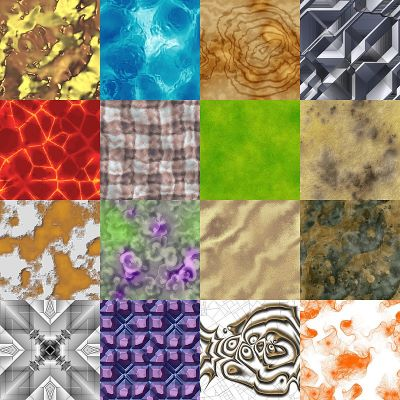

# Particle Simulation

## Motivation

This project was started as an attempt to rebuild a previous particle simulation [project](https://github.com/Jonyis/bouncing_particle_simulator) written in python.
In addition it was also an excuse to try out C++ for the first time.

## Demo

- Feature 1: Simulate bouncing particles in a 2D space. Capable of rendering more than 100k particles at 120 fps.

  https://github.com/user-attachments/assets/fb6ad588-6841-4442-9cee-b763a8e7ecc0

- Feature 2: We can also choose to render the particles with a different color based on their coordinates. 

	The color comes from a fixed image texture.

	
    
	
	The color is chosen by sampling the texture at the particle's position.

  https://github.com/user-attachments/assets/f34c25a9-dd89-40ba-b6c0-e8cd60c83df5

	With more particles the texture is even more visible, meaning we can use more complex textures.

  https://github.com/user-attachments/assets/fe4c4aa1-2dcf-451a-b941-3785fa975929

- Feature 3: Have realistic collisions between particles. Particles can collide with each other and with the walls of the simulation space. Allows for particles with diferent weights.

  https://github.com/user-attachments/assets/d3e83db9-a746-4c67-9e6c-54744353fe5e
 
